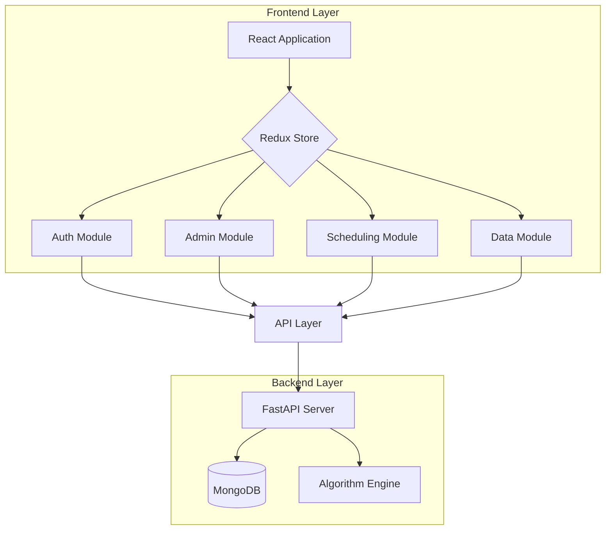
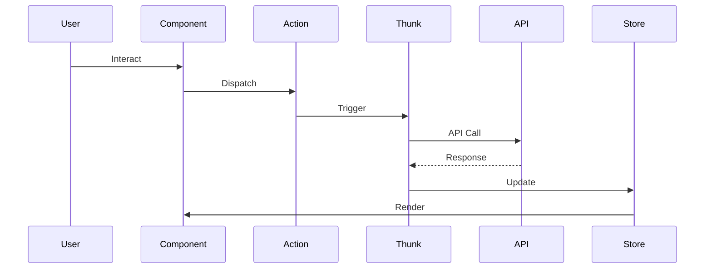

# Advanced Timetable Scheduling System


## 📚 Project Overview (Project 24-25J-238)

The Advanced Timetable Scheduling System is a cutting-edge solution designed to revolutionize university course scheduling through the power of artificial intelligence and modern web technologies. This system tackles the complex challenge of creating optimal academic timetables while considering multiple constraints, resource availability, and stakeholder preferences.

## 👥 Project creator

### project owner - kamesh fernando - cs/2019/008

### Key Features
- **Intelligent Scheduling**: Implements advanced algorithms (Genetic Algorithm, Particle Swarm Optimization,Reinforcement Learning) for optimal timetable generation
- **Real-time Conflict Resolution**: Automatically detects and resolves scheduling conflicts
- **Resource Optimization**: Efficiently manages classroom spaces, faculty availability, and other resources
- **Role-based Access Control**: Secure system access with different privileges for administrators, faculty, and students
- **Interactive Dashboard**: Modern, user-friendly interface for schedule management and visualization


### Core Objectives
- Minimize scheduling conflicts and resource overlaps
- Optimize resource utilization across the university
- Reduce manual scheduling effort and human error
- Provide flexible, data-driven scheduling solutions
- Enable real-time schedule modifications and updates
- Ensure scalability for growing institutional needs

## 🏗 System Architecture

### High-Level Architecture



## 🛠 Technical Stack

### Frontend Technologies
- **Core Framework:** React 18 with Vite
- **State Management:** Redux Toolkit
- **UI Components:** Ant Design
- **Styling:** Tailwind CSS
- **HTTP Client:** Axios
- **Routing:** React Router v6

### Development Tools
- **Build Tool:** Vite
- **Code Quality:** ESLint + Prettier
- **Testing:** Jest + RTL
- **Version Control:** Git

## 🔄 State Management Flow


## 🚀 Getting Started

### Prerequisites
- Node.js >= 16
- npm >= 8

### Installation
```bash
# Install dependencies
pnpm install

# Start development
pnpm run dev

# Build project
npm run build
```

## 🔒 Security Features

- JWT Authentication
- Role-based Access
- Input Validation
- XSS Prevention
- CSRF Protection

## 🧪 Testing Strategy

### Test Coverage
- Unit Tests
- Integration Tests
- E2E Tests
- Performance Tests

## 📈 Performance Optimization

- Code Splitting
- Lazy Loading
- Memoization
- State Optimization
- Bundle Size Management


## 📝 License
MIT License
